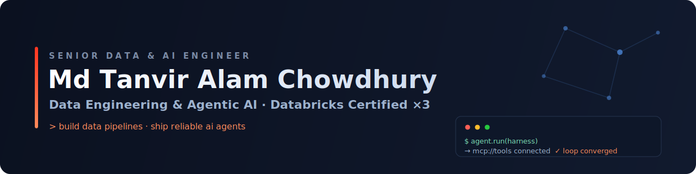

<h1 align="center">Hi, I'm Md. Tanvir Alam Chowdhury 👋</h1>

<h3 align="center">Senior Data &amp; AI Engineer · Databricks Certified Professional Data Engineer</h3>

  
  

  I build and scale <b>production data platforms and AI systems</b> — lakehouse architectures on Databricks,
  reliable ELT pipelines, and ML/LLM workloads that turn raw data into decisions.

 

---

### 🧠 Agentic Engineering — what sets me apart

> I build the **scaffolding that makes AI agents reliable in production** — the harnesses, loops, skills, and MCP servers that turn a raw model into a dependable system.

- 🧩 **Harnesses & orchestration loops** — deterministic control flow around non-deterministic models: retries, verification, and convergence instead of one-shot prompts.
- 🛠️ **Skills** — packaged, testable, composable agent capabilities that scale beyond a single prompt.
- 🔌 **MCP servers** — connecting LLMs to real tools, data, and systems through the Model Context Protocol.
- 🌉 **Full stack, data → agents** — I ship the lakehouse foundation *and* the agentic layer that runs on top of it.

---

### 🚀 About me

- 🏗️ **Senior Data & AI Engineer** at **Artefact Germany GmbH** — lakehouse platforms, streaming + batch pipelines, and MLOps end to end.
- 🔺 **Databricks Certified ×3** — Data Engineer *Professional*, Data Engineer *Associate*, and *Generative AI Engineer* Associate.
- 🤖 **Agentic engineer** — building harnesses, loops, skills, and MCP servers for production LLM systems.
- ⚡ **Software developer** shipping **Next.js / TypeScript** applications — mostly agentic interfaces and tooling.
- ☁️ Comfortable across **Azure, AWS, and GCP** — infrastructure-as-code and cost-aware.
- 📍 Based in **Hamburg, Germany** · 💬 ask me about **Spark tuning, pipeline reliability, LLMOps, and MCP**.

---

### 🏅 Certifications

**Databricks** &nbsp;·&nbsp; verified in my [credentials wallet](https://credentials.databricks.com/profile/mdtanviralamchowdhury19411/wallet)

- 🔴 **Databricks Certified Data Engineer Professional** — *2026*
- 🔴 **Databricks Certified Data Engineer Associate** — *2025*
- 🔴 **Databricks Certified Generative AI Engineer Associate** — *2025*

**Professional development**

- 📘 **Data Science Professional Certificate** — *KNIME* (LinkedIn Learning)
- 📗 **Agile Project Management Professional Certificate** — *Atlassian* (LinkedIn Learning)
- 📙 **Career Essentials in Generative AI** — *Microsoft & LinkedIn*

🔗 **[Verify all credentials →](https://credentials.databricks.com/profile/mdtanviralamchowdhury19411/wallet)**

---

### 🛠️ Tech Stack

**Data & Lakehouse**

**AI & Agentic**

**Languages & Web**

**Cloud & Infra**

---

### 🔭 What I'm building

- 🌊 Streaming + batch lakehouse pipelines with **Delta Live Tables** and **Unity Catalog** governance.
- 🤖 **Agentic harnesses & MCP servers** — reliable orchestration, reusable skills, and tool integration for production LLMs.
- ⚡ **Next.js / TypeScript** front ends for agentic workflows — where the data platform meets the user.

---

### 🌐 Connect

 

<i>“I don't just use models — I build the systems that make them dependable.”</i>

---

### 🚀 About me

- 🏗️ **Senior Data & AI Engineer** designing lakehouse platforms, streaming + batch pipelines, and MLOps workflows end to end.
- 🔺 **Databricks Certified Professional Data Engineer** — Spark, Delta Lake, Unity Catalog, and the Lakehouse in production.
- ☁️ Ship across **Azure, AWS, and GCP** — infrastructure-as-code, cost-aware, and built to scale.
- 🤖 Increasingly focused on **AI/ML & GenAI** — from feature engineering and MLflow to LLM-powered applications and RAG.
- 📍 Based in **Hamburg, Germany**, engineering data & AI solutions at **Artefact Germany GmbH**.
- 💬 Ask me about **data modeling, Spark performance tuning, pipeline reliability, and LLMOps**.

---

### 🛠️ Tech Stack

**Data & Lakehouse**

**Languages**

**Cloud & Infra**

**AI / ML**

---

### 🔎 What I'm working on

- 🌊 Streaming + batch lakehouse pipelines with **Delta Live Tables** and **Unity Catalog** governance.
- 🤝 Bringing **LLMs into production** — retrieval, evaluation, and guardrails on top of enterprise data.
- 📚 Continuously deepening **distributed systems** and **data platform reliability** practices.

---

### 🌐 Connect

  
  <!-- Add your LinkedIn URL below to enable this badge -->
  

<i>“Turning data into reliable, intelligent products.”</i>

